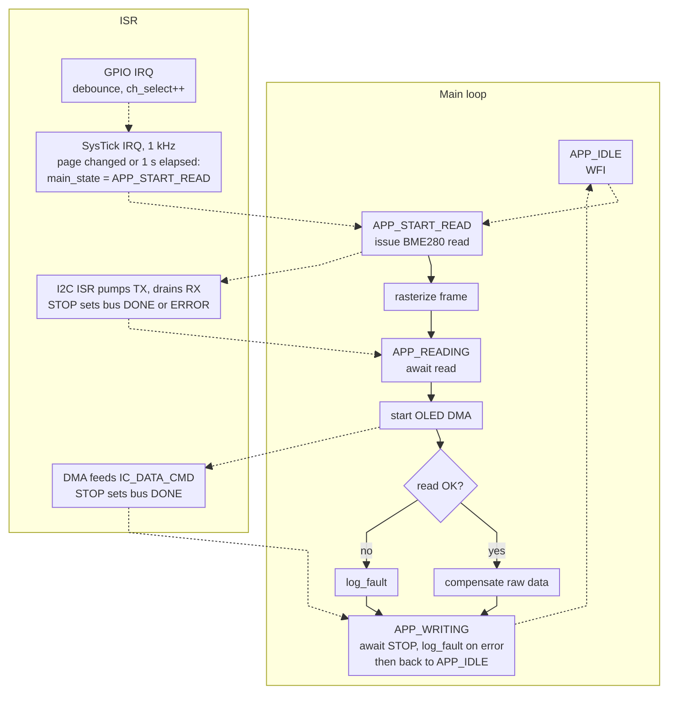

# Bare-Metal Weather Station Firmware (RP2350)

Uses `register` and `struct` headers from the `pico-sdk`.
Doesn't link against libc.

Readings are taken and rendered every second but supports faster speeds by reducing  `MAIN_PERIOD_MS`.
Both devices sit on I2C1 (GP14/GP15), the driver serialises their transfers through a state machine.
A button cycles the display between pages signalled with different LED's.

## Hardware

- Pico 2 (RP2350)
- Pico Debug Probe over SWD
- BME280 breakout (Pimoroni)
- SSD1306 128x32 OLED
- 4-pin tactile button on GP18
- Indicator LEDs on GP19 (green), GP20 (red), GP21 (yellow)

Button network:

- 10k from 3V3 to node A
- button from node A to ground
- 5k from node A to GP18 (two 10k in parallel -- see the E9 note below)
- 100nF from GP18 to ground

## Build

- `make` -- builds `build/firmware.uf2`
- `make flash` -- `probe-rs download` + reset
- `make run` -- flash and stream RTT
- `make attach` -- stream RTT from an already-running target, no flash, no reset
- `make uf2 DRIVE=/d` -- copy the image to a mounted BOOTSEL volume, no probe needed

Notes:

- point `SDK` at the `src` directory of a `pico-sdk` checkout: `make SDK=/path/to/pico-sdk/src`
- `flash`, `run` and `attach` need [`probe-rs`](https://probe.rs/) on PATH and a connected debug probe

## Components

#### **Startup** (`entry.c`, `_crt0.c`, `link.ld`)
- `entry.c` defines the vector table with irq and default handlers.
  - also defines the boot block expected by the RP2350 *([datasheet section 5.9.5](https://pip-assets.raspberrypi.com/categories/1214-rp2350/documents/RP-008373-DS-2-rp2350-datasheet.pdf/#page=429))*.
- `_crt0.c` sets the clock to the crystal oscillator, enables the fpu, copies `.data` over and zeroes `.bss`.

#### **I2C** (`driver/i2c_state_machine.c`)
- ISR state machine with per-bus context
- Three transfer paths: bulk read, sequential/alternating CPU writes, and a DMA write
- Transfers are started asynchronously and the caller polls `i2c_poll_state()` 
- I2C bus recovery sequence on reset
- Tested on a usb logic analyser: `signals/`.

#### **State Machine UML**

The current app functions through a state machine:

Note: In order to keep the CPU busy while waiting for the I2C transfers I opted for always rendering the last sample
of data rather than the current one. The current version achieves 
[~47us of bus idle time](https://github.com/Vasilis-Narain/rp2350-baremetal-weather-station/blob/main/signals/bus%20idle%20time_v1.png)
between transfers. This decision isn't negatively impacting this application as an indoor weather display doesn't need that much time accuracy.
Of course, with a 1Hz sampling rate there is ample time to compensate and rasterize the current readings before writing to the display,
but part of the aim of this project was to learn about interrupts and concurrency.

**Page selection** (`main.c`) -- the button cycles through four pages and the matching LED says which one is showing. Both edges are enabled
on GP18. The irq handler timestamps every edge and ignores a falling edge arriving within 30ms of any other edge for software debouncing 
(the design also features a double resistor hardware debounce circuit). 
Button flag changes are polled by SysTick every 1ms and applied as soon as the bus is idle.

**RP2350-E9** -- Button debouncing issues.. With the input buffer enabled and the pad sitting between logic
levels, the pad leaks up to 120uA, and the erratum asks for 8.2k or less between the pin and whatever is pulling it low. My first attempt
used 10k there, and with the button held the pin measured 1.53V,so presses did nothing. Every bit of noise during
a display update chattered the edge detector instead. Dropping that resistor to 5k puts the held level around 0.6V and it behaves. The
pull-up side is unaffected, so the 10k from 3V3 stays as it is.

**OLED** (`driver/oled.c`) -- SSD1306 driver over the same I2C bus. 512-byte page-major framebuffer with pixel, bitmap and text rasterizers.
The frame is stored as `u16` entries so the final I2C `STOP` bit can be encoded in the last word, which lets DMA push the whole frame
into `IC_DATA_CMD` without a completion IRQ or a polling loop to append the stop.

**Fonts** (`fonts.c`, `tools/font_convert.py`) -- three bitmap fonts stored in the SSD1306 page-major layout. Setting `#define MAIN_FONT 0(1,2..)` 
reduces file size to just one font.

**Writer** (`Writer.c`) -- buffered formatting, no `printf`. The idea was taken from Zig's `std.Io.Writer` interface: format into a caller-owned buffer and only do i/o on flush,
reducing i/o calls. Not conformant to `printf`. `{d}` for int, `{u}` for uint, `{u:xb}` for a (`x`)hex (`b`) byte. Decimal to string using a two-digit-at-a-time
lookup table based algorithm. Hex to string branchless SWAR algorithm, adapted from [here](https://johnnylee-sde.github.io/Fast-unsigned-integer-to-hex-string/).
The same interface backs both sinks: one instance flushes to RTT, another rasterizes into the OLED framebuffer.

**RTT** (`rtt.c`) -- Own SEGGER rtt implementation using the memory layout expected by the protocol. Using `probe-rs` to attach over SWD.

## TODO

- Use forced mode rather than normal mode for the BME280 sensor
