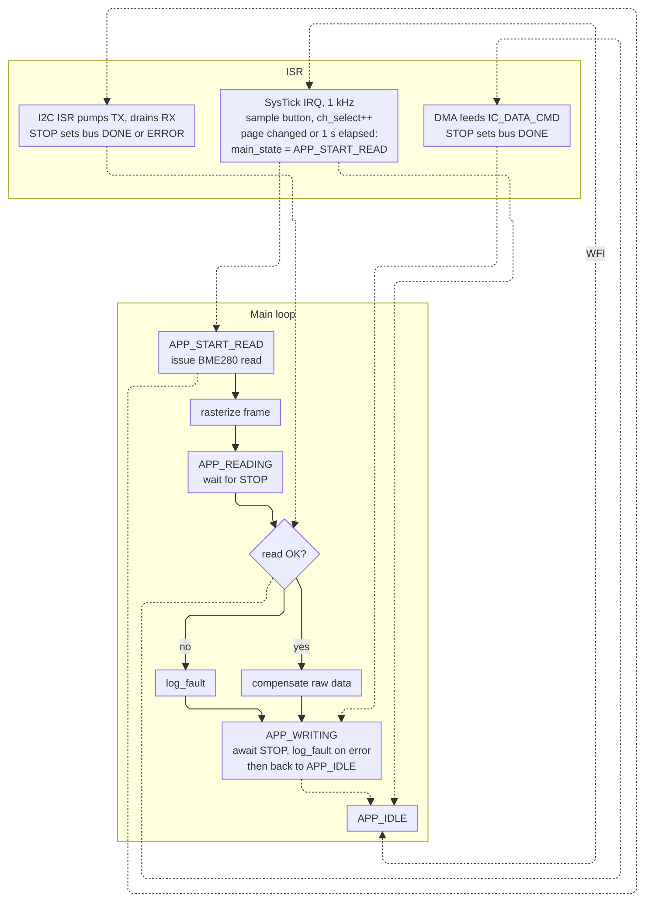

# Bare-Metal Weather Station Firmware (RP2350)

Firmware for a Pico 2 that reads a BME280 (temperature, pressure, humidity) and shows it on an SSD1306 OLED.
A button cycles between display pages, with an LED showing which page is active.

- Written in C with no SDK, HAL or libc. Only the register and struct headers from `pico-sdk` are used.
- 10.6 KB flash, no heap.
- Interrupt-driven I2C driver, with DMA for display writes. Both devices share I2C1 (GP14/GP15).
- Bus traffic checked on a logic analyser (captures in [`signals/`](signals/)).

<!-- TODO: photo of the board -->

## Hardware

- Pico 2 (RP2350)
- Pico Debug Probe over SWD
- BME280 breakout (Pimoroni)
- SSD1306 128x32 OLED
- 4-pin tactile button on GP18
- Indicator LEDs on GP19 (green), GP20 (blue), GP21 (yellow), 220R each

Full schematic: [`schematic.pdf`](schematic.pdf).

Button network:

- 100k from 3V3 to node A
- button from node A to ground
- 5.1k from node A to GP18 (see [RP2350-E9](#button-debouncing-and-rp2350-e9))
- 100nF from GP18 to ground

## Build

- `make`: builds `build/firmware.uf2`
- `make flash`: `probe-rs download` + reset
- `make run`: flash and stream RTT
- `make attach`: stream RTT from an already-running target, no flash, no reset
- `make uf2 DRIVE=/d`: copy the image to a mounted BOOTSEL volume, no probe needed

Point `SDK` at the `src` directory of a `pico-sdk` checkout: `make SDK=/path/to/pico-sdk/src`.
`flash`, `run` and `attach` need [`probe-rs`](https://probe.rs/) on PATH and a connected debug probe.

## Design notes

### I2C driver

`driver/i2c_state_machine.c`. Transfers are started asynchronously and an ISR pumps the TX FIFO and drains RX until
`STOP`, then marks the bus done or errored (abort, overrun, early stop). Each bus has its own context, so the same
code runs either controller. On init the driver checks the lines and, if a device is holding SDA low, clocks SCL
and sends a `STOP` to free the bus.

### DMA frame writes

The OLED framebuffer is stored as `u16` entries so the final I2C `STOP` bit can be encoded in the last word. That
lets DMA push the whole frame straight into `IC_DATA_CMD`, without a completion IRQ or a polling loop to append the
stop.

### Rendering while the bus is busy

To keep the CPU busy while waiting for I2C, the next frame is rasterized during the sensor read, so the display
always shows the previous sample. This gets
[~47us of bus idle time](signals/bus%20idle%20time_v1.png) between transfers
([before](signals/bus%20idle%20time_v0.png)). An indoor weather display doesn't need that kind of timing accuracy,
and at 1 Hz there's plenty of time to do it sequentially, but part of the point of this project was to learn
interrupts and concurrency.

App state machine

### Button debouncing and RP2350-E9

GP18 has no interrupt. The 1 kHz SysTick handler samples the pin into a 32-bit shift register and counts a press
when one released sample is followed by 31 pressed ones (~31ms held low), on top of the RC debounce in hardware
([Ganssle](https://www.ganssle.com/item/debouncing-switches-contacts-hardware.htm)). The page change is applied once
the bus is idle.

The first version didn't work: with the button held the pin measured 1.53V, so presses did nothing, and noise during
a display update chattered the edge detector instead. This is erratum E9:
[with the input buffer enabled and the pad sitting between logic levels, the pad leaks up to 120uA](https://hackaday.com/2024/09/20/raspberry-pi-rp2350-e9-erratum-redefined-as-input-mode-leakage-current/),
and the recommended fix is an external pull-down of 8.2k or less. I had 10k. Dropping it to 5.1k puts the held level
around 0.6V. The pull-up side is unaffected by E9.

### No libc

- **Startup**: own vector table, boot block ([datasheet 5.9.5](https://pip-assets.raspberrypi.com/categories/1214-rp2350/documents/RP-008373-DS-2-rp2350-datasheet.pdf/#page=429)),
  linker script and crt0 (crystal oscillator, FPU, `.data`/`.bss`).
- **Logging**: own SEGGER RTT implementation, read with `probe-rs` over SWD.
- **Formatting**: `Writer.c`, a small `printf` replacement based on Zig's `std.Io.Writer`: format into a buffer,
  do I/O on flush. The same interface prints to RTT and draws text into the OLED framebuffer.

## TODO

- Use forced mode rather than normal mode for the BME280 sensor
